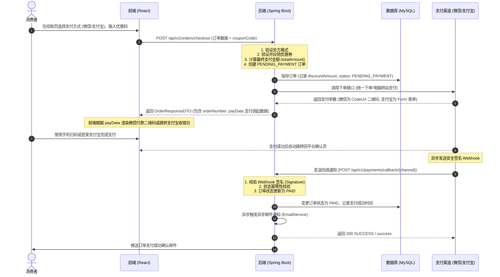
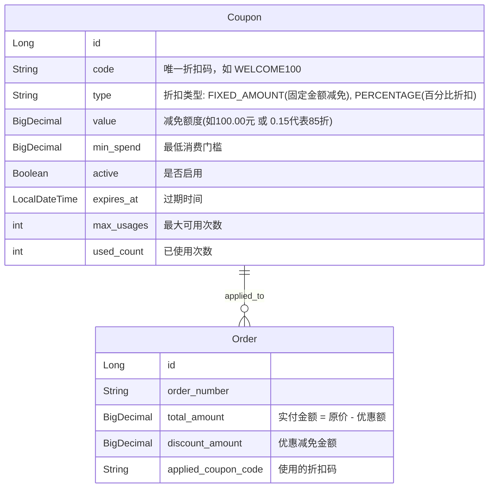

# Klarheit 平台开发手册：Phase 3 — 极简支付与轻量化营销 (MVP 黄金版)

> **定位**：初创企业 MVP（最小可行性产品）阶段的黄金实践。
> **核心策略**：避开高风险、重开发、高技术债的自研钱包系统，聚焦于中国最主流的**微信支付**与**支付宝支付**快速闭环，同时引入极轻量、安全的**优惠券/折扣码系统**作为“充值送额度”的商业替代方案，兼顾吸金营销与快速上线。

---

## 目录
1. [MVP 业务架构与双通道设计](#1-mvp-业务架构与双通道设计)
2. [轻量级营销：优惠券/折扣码子系统](#2-轻量级营销优惠券折扣码子系统)
3. [数据库迁移方案 (Flyway)](#3-数据库迁移方案-flyway)
4. [后端接口设计与支付网关解耦](#4-后端接口设计与支付网关解耦)
5. [安全性保障 (签名验证与优惠券防刷)](#5-安全性保障-签名验证与优惠券防刷)
6. [前端收银台与营销组件重构](#6-前端收银台与营销组件重构)
7. [沙箱环境与测试验证指南](#7-沙箱环境与测试验证指南)
8. [Phase 3 MVP 排期与里程碑](#8-phase-3-mvp-排期与里程碑)

---

## 1. MVP 业务架构与双通道设计

在初创阶段，我们不接触敏感金融逻辑，通过成熟的**微信支付 (WeChat Pay)** 和 **支付宝 (Alipay)** 官方 SDK 托管资金，保障资金安全性与结算效率。

### 1.1 微信/支付宝支付核心流向时序图



---

## 2. 轻量级营销：优惠券/折扣码子系统

用简单的**优惠码 (Promo Code)** 替代自研钱包充值。不仅开发难度极低（1~2天），而且非常迎合新品牌上线时发放“早鸟券”、“限时折扣”等营销策略。

### 2.1 业务实体设计 (E-R)
平台定义一张 `coupons` 表存储折扣码规则，并在 `orders` 表中关联使用凭证。



---

## 3. 数据库迁移方案 (Flyway)

在 `backend/src/main/resources/db/migration/` 中创建 `V5__payment_and_coupon_init.sql` 迁移脚本，在不引入第三方余额库的前提下，为订单和营销打好地基。

```sql
-- V5__payment_and_coupon_init.sql

-- 1. 创建优惠券规则表
CREATE TABLE coupons (
    id BIGINT AUTO_INCREMENT PRIMARY KEY,
    code VARCHAR(64) NOT NULL UNIQUE COMMENT '优惠码，如 WELCOME100',
    type VARCHAR(32) NOT NULL COMMENT '类型: FIXED_AMOUNT, PERCENTAGE',
    value DECIMAL(10, 2) NOT NULL COMMENT '抵扣值/比例',
    min_spend DECIMAL(10, 2) NOT NULL DEFAULT 0.00 COMMENT '使用门槛额度',
    active TINYINT(1) NOT NULL DEFAULT 1 COMMENT '是否有效',
    expires_at DATETIME NOT NULL COMMENT '过期时间',
    max_usages INT NOT NULL DEFAULT 9999 COMMENT '最大核销次数',
    used_count INT NOT NULL DEFAULT 0 COMMENT '已核销次数',
    created_at DATETIME NOT NULL DEFAULT CURRENT_TIMESTAMP
) ENGINE=InnoDB DEFAULT CHARSET=utf8mb4;

-- 2. 向订单表中追加支付通道与营销数据字段
ALTER TABLE orders 
    ADD COLUMN payment_channel VARCHAR(32) NULL COMMENT '支付通道: WECHAT, ALIPAY',
    ADD COLUMN gateway_transaction_id VARCHAR(255) NULL COMMENT '微信支付单号/支付宝交易号',
    ADD COLUMN discount_amount DECIMAL(10, 2) NOT NULL DEFAULT 0.00 COMMENT '优惠券减免金额',
    ADD COLUMN applied_coupon_code VARCHAR(64) NULL COMMENT '使用的优惠码',
    ADD COLUMN paid_at DATETIME NULL COMMENT '实付完成时间';

-- 3. 建立对账和 Webhook 检索索引
CREATE INDEX idx_orders_gateway_tx_id ON orders(gateway_transaction_id);

-- 4. 初始化一张早鸟满减优惠券，用于上线测试
INSERT INTO coupons (code, type, value, min_spend, active, expires_at) 
VALUES ('KLARHEIT80', 'FIXED_AMOUNT', 80.00, 500.00, 1, '2027-12-31 23:59:59');
```

---

## 4. 后端接口设计与支付网关解耦

为微信和支付宝支付提供统一的抽象，保持接口的高雅性。

### 4.1 支付网关层抽象

在 `com.klarheit.backend.payment` 包下定义核心支付接口：

```java
package com.klarheit.backend.payment;

import java.math.BigDecimal;

public interface PaymentService {
    /**
     * 发起收单支付意向
     * @param orderNumber 平台订单号
     * @param amount 实付金额
     * @param channel 渠道 (WECHAT / ALIPAY)
     * @return 包含支付凭证和前端拉起参数 (如二维码链接或支付宝 HTML Form)
     */
    PaymentInitiateResult initiatePayment(String orderNumber, BigDecimal amount, String channel);
}
```

```java
package com.klarheit.backend.payment;

public record PaymentInitiateResult(String transactionId, String payData) {}
```

### 4.2 优惠券验证与应用逻辑
在 `OrderService.java` 中嵌入轻量级核销机制：

```java
// 优惠码验证内部逻辑
private BigDecimal calculateDiscount(String couponCode, BigDecimal originalAmount) {
    if (couponCode == null || couponCode.isBlank()) {
        return BigDecimal.ZERO;
    }
    
    Coupon coupon = couponRepository.findByCodeIgnoreCaseAndActiveTrue(couponCode.trim())
            .orElseThrow(() -> new IllegalArgumentException("优惠码不存在或已被禁用。"));
            
    if (coupon.getExpiresAt().isBefore(LocalDateTime.now())) {
        throw new IllegalArgumentException("该优惠码已过期。");
    }
    
    if (coupon.getUsedCount() >= coupon.getMaxUsages()) {
        throw new IllegalArgumentException("该优惠码已被使用完毕。");
    }
    
    if (originalAmount.compareTo(coupon.getMinSpend()) < 0) {
        throw new IllegalArgumentException("未达到该优惠码的最低消费门槛（￥" + coupon.getMinSpend() + "）。");
    }
    
    if ("FIXED_AMOUNT".equals(coupon.getType())) {
        return coupon.getValue();
    } else if ("PERCENTAGE".equals(coupon.getType())) {
        return originalAmount.multiply(coupon.getValue());
    }
    
    return BigDecimal.ZERO;
}
```

---

## 5. 安全性保障 (签名验证与优惠券防刷)

### 5.1 异步 Webhook 安全性校验（以支付宝为例）
必须验证来自三方网关通知的真实性，防止恶意网络包攻击。

```java
package com.klarheit.backend.payment;

import com.alipay.api.internal.util.AlipaySignature;
import jakarta.servlet.http.HttpServletRequest;
import lombok.extern.slf4j.Slf4j;
import org.springframework.beans.factory.annotation.Value;
import org.springframework.http.ResponseEntity;
import org.springframework.web.bind.annotation.*;
import java.util.HashMap;
import java.util.Map;

@Slf4j
@RestController
@RequestMapping("/api/v1/payments/callback")
public class PaymentCallbackController {

    @Value("${app.alipay.public-key}")
    private String alipayPublicKey;

    @PostMapping("/alipay")
    public ResponseEntity<String> handleAlipayCallback(HttpServletRequest request) {
        // 1. 解析支付宝回调参数
        Map<String, String> params = new HashMap<>();
        Map<String, String[]> requestParams = request.getParameterMap();
        for (String name : requestParams.keySet()) {
            String[] values = requestParams.get(name);
            params.put(name, String.join(",", values));
        }

        try {
            // 2. 验签 (支付宝官方验签方法)
            boolean signVerified = AlipaySignature.rsaCheckV1(params, alipayPublicKey, "UTF-8", "RSA2");
            if (!signVerified) {
                log.warn("Alipay signature verification failed.");
                return ResponseEntity.badRequest().body("failure");
            }
        } catch (Exception e) {
            log.error("Error verifying Alipay signature", e);
            return ResponseEntity.badRequest().body("failure");
        }

        // 3. 解析核心支付数据，流转订单状态 (幂等保证)
        String tradeStatus = params.get("trade_status");
        String outTradeNo = params.get("out_trade_no"); // 对应我们的平台订单号

        if ("TRADE_SUCCESS".equals(tradeStatus)) {
            // 在事务中更新订单状态为 PAID，生成支付确认审计，触发邮件
            log.info("Order {} successfully paid via Alipay.", outTradeNo);
        }

        return ResponseEntity.ok("success");
    }
}
```

### 5.2 优惠券超卖与高并发核销防刷
为了防止同一张限量优惠券在并发结算时被多个用户“超刷”导致负数，核销优惠券时采用**扣减行锁校验**：

```sql
-- 扣减优惠券已用次数的原子 SQL
UPDATE coupons 
SET used_count = used_count + 1 
WHERE id = :couponId 
  AND used_count < max_usages 
  AND active = 1;
```
如果更新的受影响行数 (Rows Affected) 为 `0`，则事务回滚，抛出“优惠券已被抢光”异常。

---

## 6. 前端收银台与营销组件重构

前端结账页组件（`front_end/src/pages/Checkout.tsx`）进行视觉与逻辑优化：

### 6.1 聚合收银台 UI 设计 (支付方式选择)
废除原本假信用卡的输入表单，改为大方、直观的微信支付、支付宝支付单选色块。

```tsx
// 支付通道选择状态
const [paymentChannel, setPaymentChannel] = useState<"WECHAT" | "ALIPAY">("WECHAT");

return (
  <SectionCard title="选择支付方式" eyebrow="Step 03" description="请选择您常用的安全支付渠道">
    <div className="grid grid-cols-1 sm:grid-cols-2 gap-4">
      {/* 微信支付卡片 */}
      <div 
        onClick={() => setPaymentChannel("WECHAT")}
        className={`border-2 rounded-2xl p-5 flex items-center justify-between cursor-pointer transition-all ${
          paymentChannel === "WECHAT" 
            ? "border-emerald-500 bg-emerald-50/20" 
            : "border-slate-200 bg-white hover:border-slate-300"
        }`}
      >
        <div className="flex items-center gap-3">
          <div className="w-5 h-5 rounded-full border-4 border-emerald-500 bg-white" />
          <span className="text-sm font-semibold text-slate-800">微信支付 (WeChat Pay)</span>
        </div>
        <div className="w-8 h-8 bg-emerald-500 rounded-lg flex items-center justify-center text-white font-bold text-xs">微</div>
      </div>

      {/* 支付宝卡片 */}
      <div 
        onClick={() => setPaymentChannel("ALIPAY")}
        className={`border-2 rounded-2xl p-5 flex items-center justify-between cursor-pointer transition-all ${
          paymentChannel === "ALIPAY" 
            ? "border-sky-500 bg-sky-50/20" 
            : "border-slate-200 bg-white hover:border-slate-300"
        }`}
      >
        <div className="flex items-center gap-3">
          <div className="w-5 h-5 rounded-full border-4 border-sky-500 bg-white" />
          <span className="text-sm font-semibold text-slate-800">支付宝支付 (Alipay)</span>
        </div>
        <div className="w-8 h-8 bg-sky-500 rounded-lg flex items-center justify-center text-white font-bold text-xs">支</div>
      </div>
    </div>
  </SectionCard>
);
```

### 6.2 优惠码验证组件 (Promo Input Box)
在右侧的订单明细（Order Manifest）卡片中融入优惠码校验栏，通过异步请求获取实时减免。

```tsx
const [couponCode, setCouponCode] = useState("");
const [discount, setDiscount] = useState(0);
const [couponError, setCouponError] = useState("");

const handleApplyCoupon = async () => {
  setCouponError("");
  try {
    // 调用后端轻量级优惠券验证接口
    const res = await validateCouponApi({ code: couponCode, currentAmount: subtotal });
    setDiscount(res.discountAmount);
  } catch (err) {
    setDiscount(0);
    setCouponError("无效的优惠码或未达门槛");
  }
};
```

---

## 7. 沙箱环境与测试验证指南

初创企业调试支付无需使用真实资金，各大平台均提供了完备的沙箱联调支持。

### 7.1 支付宝沙箱测试 (Alipay Sandbox)
1. **入驻沙箱**：登录支付宝开放平台，进入控制台选择“沙箱”。
2. **下载“沙箱版支付宝”APP** (目前仅支持安卓，提供模拟资金)。
3. **获取测试密钥**：
   * **APPID**：沙箱专用 APPID（如 `9021000123...`）
   * **应用私钥** / **支付宝公钥**：填入本地 `src/main/resources/application.properties`
   * **网关地址**：`https://openapi-sandbox.dl.alipaydev.com/gateway.do`
4. **沙箱测试账号**：使用沙箱账号中的“买家账号”（提供模拟密码与余额）在测试 APP 中直接扫码完成支付确认。

### 7.2 微信支付沙箱 (WeChat Pay Sandbox)
* 微信官方提供免充值测试用例。通过向 `https://api.mch.weixin.qq.com/sandboxnew/pay/getsignkey` 获取沙箱环境的专属 `APIKEY`，即可在本地测试完整的 Webhook 回调流转。

---

## 8. Phase 3 MVP 排期与里程碑

为了让产品以最高质量、最快速度发布上线，建议按以下 **3个迭代里程碑 (Milestones)** 滚动排期，开发周期约 10~12 天：

```
[M1: 数据库与优惠券] ──> [M2: 后端支付网关与验签] ──> [M3: 前端收银台与大闭环验证]
     (第 1-3 天)                (第 4-7 天)                  (第 8-10 天)
```

### 🎯 Milestone 1：地基搭建与优惠券功能 (第 1~3 天)
- [ ] 运行 Flyway 脚本创建优惠券表，追加订单表支付字段。
- [ ] 编写 `CouponController` 和优惠验证核心算法。
- [ ] 前端 Checkout 结账页增加优惠码输入框，编写异步验证联动，实现实时价格扣减渲染。

### 🎯 Milestone 2：支付网关接入与 Webhook (第 4~7 天)
- [ ] 编写 `PaymentService` 接口，分别实现微信与支付宝下单逻辑。
- [ ] 编写回调处理器 `PaymentCallbackController`，强制启用签名验证。
- [ ] Webhook 内部状态流转接入乐观锁/悲观锁保障，将支付状态与 `EmailService` 回调事件串联，完成 PAID 状态激活发信。

### 🎯 Milestone 3：前端收银台与沙箱贯通 (第 8~10 天)
- [ ] 前端重构收银台选择组件（单选微信/支付宝）。
- [ ] 接入支付返回结果（生成微信扫码二维码 / 跳转支付宝沙箱表单）。
- [ ] 使用支付宝沙箱 APP 与买家模拟账户，完成“选镜 -> 享用优惠码 -> 选择支付宝 -> 手机扫码测试支付 -> 异步 Webhook 接收 -> 改变订单为 PAID -> 收到支付成功邮件”的全链路黄金闭环测试，保障发布级品质。
